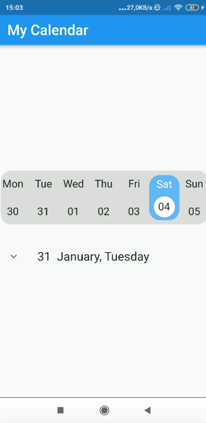

# calendar with bloc

In this project, a calendar application was made with the block library, which is included in the flutter state management solutions and is widely used in the industry, and OOP was also used.

